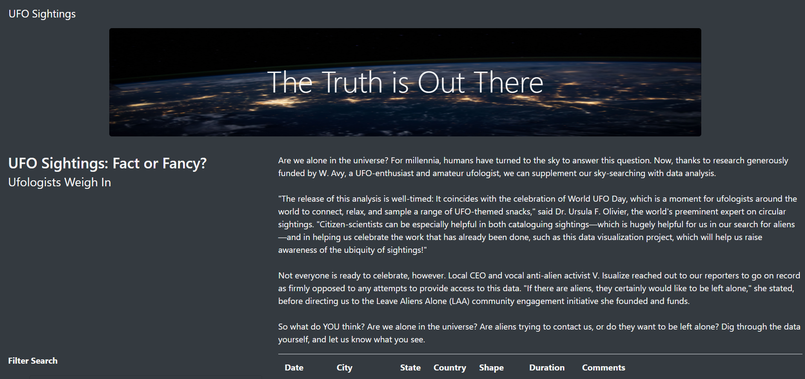

# Analysis of Creating a UFO Sightings Finder Webpage

# Analysis Overview

Using VS Code, three separate files were created to: 
### 1 create the layout of the webpage (html.index); 
### 2 create the code to populate the webage as well as filter the data (app.js); and 
### 3 format the webpage (style.css)

DevTools in Chrome was used to test and debug the code.  The data used to populate the webpage was provided in a .js format.  

The purpose is well defined (2 pt)
Results:
create a webpage that contains searchable fields to obtain UFO sighting information.  Five fields are searchable in any combination.

There is a description of how to perform a search, with images. (4 pt)
insert screen shots 
type in a search criteria (up to 5 different filters)

Summary:
Webpage contains a lot of info which can be overwhelming.  The searchable filters allows user to view small chunks of the data.

The summary addresses one drawback of this webpage (2 pt)
data in the table is all lower case and if user entered upper case, filter would fail.

The summary addresses two additional recommendations for further development (4 pt)
convert all entries to lower case to reduce errors

add search feature to comment field.
