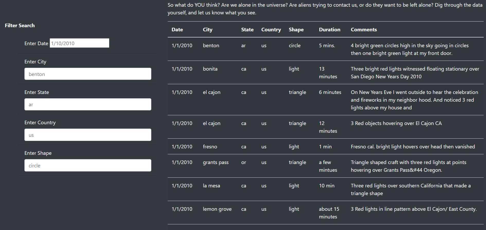

Creating a UFO Sightings Finder Webpage

# Analysis Overview

Using VS Code, three separate files were created to: 
1.  create the layout of the webpage (html.index); 
1.  create the code to populate the webage as well as filter the data (app.js); and 
1.  format the webpage (style.css)

DevTools in Chrome was used to test and debug the code.  The data used to populate the webpage was provided in a .js format.  

# Purpose 
The purpose of creating the webpage was to make UFO sighting information readily available.  Due to the volume of information, viewing the data was overwhelming to the user.  To reduce observation strain, searchable fields were added to the webpage.  Users can search sightings, by any combination, of: date; city, state, country and shape of UFO.  The searchable aspect lends viewing flexibility to the webpage. 

## Results
Please see images below to view the final webpage.  The first image is the upper half of the webpage.  

To view the data, user can scroll down the page to see all the sightings.  If user wants to view specific records, they can enter one or more criteria(s) in the input boxes.  The image below displays the five(5) input boxes user can select to filter their view.  The input boxes have sample data showing that indicate how each entry should be typed.  Date is in "M/D/YYYY" format; city is entered in lower case; state is a 2-letter abbreviation in lower case; country is a 2-letter abreviation in lower case; and shape is entered in lower case.  Once the criteria is entered, user can either press enter or the tab key.

# Summary
The completed webpage contains a vast amount of information, which some could find overwhelming.  Adding the five searchable filters allows user to view small subsets of the data.

One drawback of the webpage is that the data in the table is in lower case.  If a user entered 'CA' instead of 'ca', an error will occur as the JavaScript is case sensitive.  The same would happen if a city was enter in proper casing (Seattle versus seattle).  

To address the issue of the case senitivity of search fields, a recommendation is to convert all filter entries into lower case values as well as placing a date mask in the date field.  This way, all text will be searched by lower case letters and user woulbe forced to enter the date correctly.  

A second recommendation to further develop the webpage is to add search feature to comments field.   It would offer additional functionality as well as an additional source of information.  
